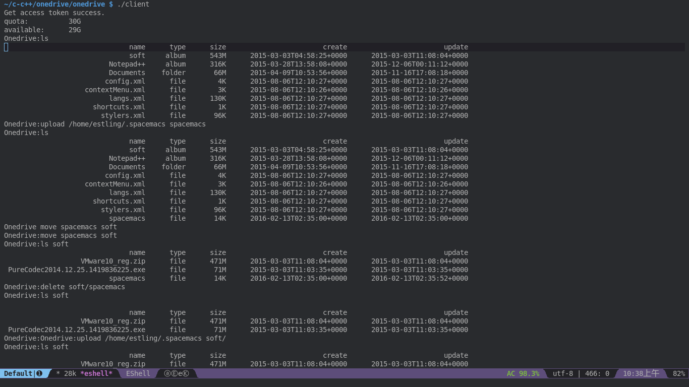

# OneDrive Client

## What it is

Linux下简单的OneDrive客户端，运行在命令行下。

## Screenshot



## Install

```bash
./configure
make
make install
```

Now we have database support, so [sqlite3](http://www.sqlite.org/) is required.
If you are in fedora, you can install it like this.
```bash
sudo dnf install sqlite sqlite-devel
```

## Usage

The first time you run it, it will give you a link and you should
open it use your web browser, log in and choose "Yes", then a redirect
link will return with "code" scope. That's what we need.
